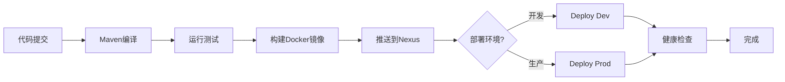

# CI/CD 实战指南

## 🎯 概述

本文档提供三种CI/CD实现方式：
1. **本地模拟CI/CD**（推荐，快速测试）
2. **GitLab CI/CD**（标准方案）
3. **GitHub Actions**（可选）

---

## 方式1：本地模拟CI/CD（推荐）

### 使用场景
- 快速测试CI/CD流程
- 没有GitLab环境
- 本地开发和验证

### 执行步骤

```bash
cd /Users/zgy/Documents/workspace-web3/CollaborativeTasks2

# 添加执行权限
chmod +x scripts/ci-cd-local.sh

# 运行CI/CD流程
./scripts/ci-cd-local.sh
```

### 脚本执行流程

```
[阶段1/4] Maven编译
    ↓
[阶段2/4] 运行测试（可选）
    ↓
[阶段3/4] 构建Docker镜像
    ├─ collabtask-api:VERSION
    ├─ collabtask-api:latest
    ├─ collabtask-gateway:VERSION
    └─ collabtask-gateway:latest
    ↓
[阶段4/4] 推送到Nexus
    ↓
[可选] 重新部署服务
```

---

## 方式2：GitLab CI/CD

### 前提条件

1. **GitLab服务器**
   - 本地GitLab（docker运行）
   - 或GitLab.com账号

2. **GitLab Runner**
   - 注册Runner到GitLab

3. **配置环境变量**

### 步骤1：启动本地GitLab（可选）

如果没有GitLab服务器，可以用Docker启动：

```bash
# 启动GitLab（已在你的docker ps中看到）
docker run -d \
  --name gitlab \
  -p 8084:80 \
  -p 2222:22 \
  -v gitlab-data:/var/opt/gitlab \
  gitlab/gitlab-ce:latest

# 获取初始密码
docker exec gitlab grep 'Password:' /etc/gitlab/initial_root_password

# 访问: http://localhost:8084
# 用户名: root
# 密码: 上面命令的输出
```

### 步骤2：安装GitLab Runner

```bash
# macOS
brew install gitlab-runner

# 启动Runner
gitlab-runner start
```

### 步骤3：注册Runner

```bash
# 在GitLab项目页面获取Token
# Settings → CI/CD → Runners → New project runner

gitlab-runner register \
  --url http://localhost:8084 \
  --registration-token YOUR_TOKEN \
  --executor docker \
  --docker-image docker:24 \
  --description "Local Docker Runner"
```

### 步骤4：配置GitLab CI/CD变量

在GitLab项目中：**Settings → CI/CD → Variables**

添加以下变量：

| 变量名 | 值 | 说明 |
|--------|-----|------|
| `NEXUS_REGISTRY` | `localhost:5000` | Nexus Registry地址 |
| `NEXUS_USERNAME` | `admin` | Nexus用户名 |
| `NEXUS_PASSWORD` | `123456` | Nexus密码（Protected） |
| `NEXUS_MAVEN_REPO` | `http://localhost:8081/repository/maven-public/` | Maven仓库 |

### 步骤5：推送代码触发CI/CD

```bash
# 初始化Git仓库（如果还没有）
git init
git add .
git commit -m "Initial commit with CI/CD"

# 添加GitLab远程仓库
git remote add origin http://localhost:8084/your-username/collabtask.git

# 推送代码
git push -u origin main
```

### 查看Pipeline

访问：http://localhost:8084/your-project/-/pipelines

---

## 方式3：使用Makefile快速操作

项目已包含Makefile，提供快捷命令：

```bash
# 查看所有可用命令
make help

# 完整CI/CD流程
make ci-cd

# 单独执行某个阶段
make build          # Maven编译
make docker-build   # 构建镜像
make docker-push    # 推送到Nexus
make deploy-local   # 本地部署
```

---

## 📊 CI/CD流程图



---

## 🔍 常见问题

### 1. Maven编译失败

**问题**：依赖下载失败

**解决**：
```bash
# 清理Maven缓存
mvn clean
rm -rf ~/.m2/repository

# 使用阿里云镜像
# 编辑 ~/.m2/settings.xml
```

### 2. Docker构建失败

**问题**：找不到JAR文件

**解决**：
```bash
# 确保先编译
mvn clean package -DskipTests

# 检查JAR是否存在
ls -l collabtask-api/target/*.jar
ls -l collabtask-gateway/target/*.jar
```

### 3. 推送Nexus失败

**问题**：登录失败或超时

**解决**：
```bash
# 检查Nexus运行状态
docker ps | grep nexus

# 测试登录
docker login localhost:5000 -u admin -p 123456

# 检查Docker Bearer Token Realm
# 访问 http://localhost:8081
# Settings → Security → Realms
# 激活 Docker Bearer Token Realm
```

### 4. GitLab Runner无法访问Docker

**问题**：Runner执行docker命令失败

**解决**：
```bash
# 给Runner添加Docker权限
sudo usermod -aG docker gitlab-runner

# 重启Runner
gitlab-runner restart
```

---

## 📋 版本管理策略

### Git分支策略

```
main (生产)
  ↑
develop (开发)
  ↑
feature/* (功能分支)
```

### 触发规则

- **main分支**：自动构建 + 手动部署生产
- **develop分支**：自动构建 + 手动部署开发
- **feature分支**：仅编译和测试

---

## 🎓 最佳实践

### 1. 镜像标签策略

```bash
# 使用Git提交SHA作为版本号
localhost:5000/collabtask-api:abc1234  # 特定版本
localhost:5000/collabtask-api:latest   # 最新版本
```

### 2. 环境隔离

```yaml
# development环境
IMAGE_TAG: latest

# production环境
IMAGE_TAG: v1.0.0  # 固定版本
```

### 3. 健康检查

部署后自动检查服务状态：

```bash
#!/bin/bash
# 等待服务启动
sleep 30

# 检查健康端点
curl -f http://localhost:8001/actuator/health || exit 1
```

---

## 🚀 下一步

1. ✅ 本地测试CI/CD流程
2. ⬜ 配置GitLab Runner
3. ⬜ 设置自动化部署
4. ⬜ 添加监控和告警

---

## 📚 相关文档

- [GitLab CI/CD配置指南](./GitLab-CICD配置指南.md)
- [Docker部署指南](./Docker部署指南.md)
- [Nexus配置指南](./Nexus配置指南.md)

